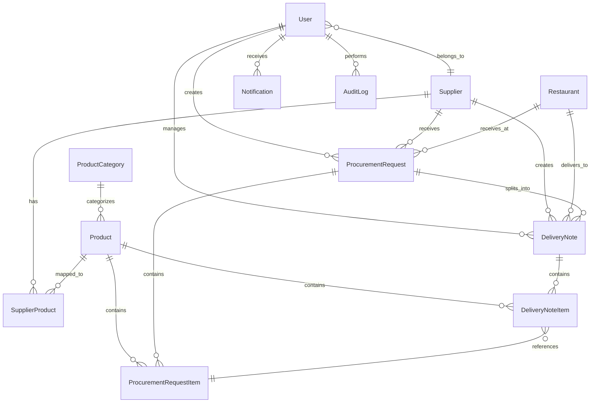

# ĐẶC TẢ THỰC THỂ VÀ DATABASE SCHEMA
## Entity Specification for YCMS - Procurement Management System

---

**Version**: 1.0  
**Last Updated**: 2025-10-08  
**Status**: ✅ Ready for Implementation  
**Author**: Database Architect  

---

## 📐 SƠ ĐỒ QUAN HỆ TỔNG THỂ (ER DIAGRAM)



---

## 🗄️ CHI TIẾT CÁC ENTITY

### 1. USER - Người Dùng Hệ Thống

**Mô tả**: Quản lý thông tin user, hỗ trợ 2 loại user chính: Aladdin Staff và Supplier Staff

#### Model Definition (SQLAlchemy)

```python
# app/models/user.py
"""
User model với FastAPI-Users integration
Hỗ trợ authentication, authorization, và user management
"""

from datetime import datetime
from typing import Optional, List
from sqlalchemy import String, Boolean, Integer, DateTime, ForeignKey, Enum as SQLEnum
from sqlalchemy.orm import Mapped, mapped_column, relationship
from fastapi_users.db import SQLAlchemyBaseUserTable

from app.models.base import Base, TimestampMixin
import enum


class UserType(str, enum.Enum):
    """User type enumeration"""
    ALADDIN = "aladdin"
    SUPPLIER = "supplier"


class UserRole(str, enum.Enum):
    """User role enumeration"""
    SUPER_ADMIN = "super_admin"
    ALADDIN_ADMIN = "aladdin_admin"
    ALADDIN_STAFF = "aladdin_staff"
    SUPPLIER_ADMIN = "supplier_admin"
    SUPPLIER_STAFF = "supplier_staff"


class User(SQLAlchemyBaseUserTable[int], Base, TimestampMixin):
    """
    User model với FastAPI-Users
    
    Attributes:
        id: Primary key
        email: Email (unique)
        hashed_password: Password đã hash
        is_active: User có active không
        is_superuser: User có quyền superuser không
        is_verified: Email đã verify chưa
        user_type: Loại user (aladdin/supplier)
        role: Role của user
        supplier_id: ID nhà cung cấp (nếu là supplier)
        first_name: Tên
        last_name: Họ
        phone: Số điện thoại
        avatar_url: URL avatar
        last_login: Thời điểm login cuối
    """
    
    __tablename__ = "users"
    
    # FastAPI-Users fields (inherited from SQLAlchemyBaseUserTable)
    # id, email, hashed_password, is_active, is_superuser, is_verified
    
    # Additional fields
    user_type: Mapped[UserType] = mapped_column(
        SQLEnum(UserType),
        nullable=False,
        comment="Loại user: aladdin hoặc supplier"
    )
    
    role: Mapped[UserRole] = mapped_column(
        SQLEnum(UserRole),
        nullable=False,
        comment="Role của user trong hệ thống"
    )
    
    supplier_id: Mapped[Optional[int]] = mapped_column(
        Integer,
        ForeignKey("suppliers.id", ondelete="CASCADE"),
        nullable=True,
        comment="ID nhà cung cấp (null nếu là Aladdin user)"
    )
    
    first_name: Mapped[str] = mapped_column(
        String(50),
        nullable=False,
        comment="Tên"
    )
    
    last_name: Mapped[str] = mapped_column(
        String(50),
        nullable=False,
        comment="Họ"
    )
    
    phone: Mapped[Optional[str]] = mapped_column(
        String(20),
        nullable=True,
        comment="Số điện thoại"
    )
    
    avatar_url: Mapped[Optional[str]] = mapped_column(
        String(255),
        nullable=True,
        comment="URL ảnh đại diện"
    )
    
    last_login: Mapped[Optional[datetime]] = mapped_column(
        DateTime(timezone=True),
        nullable=True,
        comment="Thời điểm login cuối cùng"
    )
    
    # Relationships
    supplier: Mapped[Optional["Supplier"]] = relationship(
        "Supplier",
        back_populates="users",
        lazy="selectin"
    )
    
    created_procurement_requests: Mapped[List["ProcurementRequest"]] = relationship(
        "ProcurementRequest",
        back_populates="created_by_user",
        foreign_keys="ProcurementRequest.created_by"
    )
    
    notifications: Mapped[List["Notification"]] = relationship(
        "Notification",
        back_populates="user",
        cascade="all, delete-orphan"
    )
    
    audit_logs: Mapped[List["AuditLog"]] = relationship(
        "AuditLog",
        back_populates="user",
        cascade="all, delete-orphan"
    )
    
    # Indexes
    __table_args__ = (
        {"comment": "Bảng user hệ thống với FastAPI-Users"},
    )
    
    def __repr__(self) -> str:
        return f"<User(id={self.id}, email={self.email}, type={self.user_type})>"
    
    @property
    def full_name(self) -> str:
        """Get full name"""
        return f"{self.first_name} {self.last_name}"
    
    def is_aladdin_user(self) -> bool:
        """Check if user is Aladdin staff"""
        return self.user_type == UserType.ALADDIN
    
    def is_supplier_user(self) -> bool:
        """Check if user is supplier staff"""
        return self.user_type == UserType.SUPPLIER
    
    def has_role(self, role: UserRole) -> bool:
        """Check if user has specific role"""
        return self.role == role
```

#### Pydantic Schemas

```python
# app/schemas/user.py
"""
User schemas for API request/response
"""

from typing import Optional
from datetime import datetime
from pydantic import BaseModel, EmailStr, Field, field_validator
from fastapi_users import schemas

from app.models.user import UserType, UserRole


class UserRead(schemas.BaseUser[int]):
    """User response schema"""
    
    user_type: UserType
    role: UserRole
    supplier_id: Optional[int] = None
    first_name: str
    last_name: str
    phone: Optional[str] = None
    avatar_url: Optional[str] = None
    created_at: datetime
    last_login: Optional[datetime] = None
    
    class Config:
        from_attributes = True


class UserCreate(schemas.BaseUserCreate):
    """User creation schema"""
    
    user_type: UserType = Field(..., description="Loại user")
    role: UserRole = Field(..., description="Role của user")
    supplier_id: Optional[int] = Field(None, description="ID nhà cung cấp (nếu là supplier)")
    first_name: str = Field(..., min_length=2, max_length=50, description="Tên")
    last_name: str = Field(..., min_length=2, max_length=50, description="Họ")
    phone: Optional[str] = Field(None, pattern=r'^\+?1?\d{9,15}$', description="Số điện thoại")
    
    @field_validator('email')
    @classmethod
    def email_lowercase(cls, v: EmailStr) -> str:
        """Convert email to lowercase"""
        return v.lower()
    
    @field_validator('password')
    @classmethod
    def password_strength(cls, v: str) -> str:
        """Validate password strength"""
        if len(v) < 8:
            raise ValueError('Password must be at least 8 characters')
        if not any(char.isdigit() for char in v):
            raise ValueError('Password must contain at least one digit')
        if not any(char.isupper() for char in v):
            raise ValueError('Password must contain at least one uppercase letter')
        return v
    
    @field_validator('supplier_id')
    @classmethod
    def validate_supplier_id(cls, v, info):
        """Supplier ID is required for supplier users"""
        user_type = info.data.get('user_type')
        if user_type == UserType.SUPPLIER and v is None:
            raise ValueError('supplier_id is required for supplier users')
        if user_type == UserType.ALADDIN and v is not None:
            raise ValueError('supplier_id should be null for Aladdin users')
        return v


class UserUpdate(schemas.BaseUserUpdate):
    """User update schema"""
    
    first_name: Optional[str] = Field(None, min_length=2, max_length=50)
    last_name: Optional[str] = Field(None, min_length=2, max_length=50)
    phone: Optional[str] = Field(None, pattern=r'^\+?1?\d{9,15}$')
    avatar_url: Optional[str] = Field(None, max_length=255)
```

#### Database Migration

```python
# alembic/versions/001_create_users_table.py
"""create users table

Revision ID: 001
Revises: 
Create Date: 2025-10-08

"""
from alembic import op
import sqlalchemy as sa
from sqlalchemy.dialects import postgresql

# revision identifiers
revision = '001'
down_revision = None
branch_labels = None
depends_on = None


def upgrade() -> None:
    # Create user_type enum
    user_type_enum = postgresql.ENUM('aladdin', 'supplier', name='usertype')
    user_type_enum.create(op.get_bind())
    
    # Create user_role enum
    user_role_enum = postgresql.ENUM(
        'super_admin', 'aladdin_admin', 'aladdin_staff', 
        'supplier_admin', 'supplier_staff', 
        name='userrole'
    )
    user_role_enum.create(op.get_bind())
    
    # Create users table
    op.create_table(
        'users',
        sa.Column('id', sa.Integer(), autoincrement=True, nullable=False),
        sa.Column('email', sa.String(length=320), nullable=False),
        sa.Column('hashed_password', sa.String(length=1024), nullable=False),
        sa.Column('is_active', sa.Boolean(), nullable=False, server_default='true'),
        sa.Column('is_superuser', sa.Boolean(), nullable=False, server_default='false'),
        sa.Column('is_verified', sa.Boolean(), nullable=False, server_default='false'),
        sa.Column('user_type', user_type_enum, nullable=False),
        sa.Column('role', user_role_enum, nullable=False),
        sa.Column('supplier_id', sa.Integer(), nullable=True),
        sa.Column('first_name', sa.String(length=50), nullable=False),
        sa.Column('last_name', sa.String(length=50), nullable=False),
        sa.Column('phone', sa.String(length=20), nullable=True),
        sa.Column('avatar_url', sa.String(length=255), nullable=True),
        sa.Column('last_login', sa.DateTime(timezone=True), nullable=True),
        sa.Column('created_at', sa.DateTime(timezone=True), server_default=sa.text('now()'), nullable=False),
        sa.Column('updated_at', sa.DateTime(timezone=True), server_default=sa.text('now()'), nullable=False),
        sa.ForeignKeyConstraint(['supplier_id'], ['suppliers.id'], ondelete='CASCADE'),
        sa.PrimaryKeyConstraint('id'),
        comment='Bảng user hệ thống với FastAPI-Users'
    )
    
    # Create indexes
    op.create_index('ix_users_email', 'users', ['email'], unique=True)
    op.create_index('ix_users_supplier_id', 'users', ['supplier_id'])
    op.create_index('ix_users_user_type', 'users', ['user_type'])
    op.create_index('ix_users_role', 'users', ['role'])


def downgrade() -> None:
    op.drop_index('ix_users_role', table_name='users')
    op.drop_index('ix_users_user_type', table_name='users')
    op.drop_index('ix_users_supplier_id', table_name='users')
    op.drop_index('ix_users_email', table_name='users')
    op.drop_table('users')
    
    # Drop enums
    op.execute('DROP TYPE userrole')
    op.execute('DROP TYPE usertype')
```

---

### 2. SUPPLIER - Nhà Cung Cấp

**Mô tả**: Quản lý thông tin các nhà cung cấp nguyên liệu, thực phẩm

#### Model Definition

```python
# app/models/supplier.py
"""
Supplier model - Nhà cung cấp
"""

from typing import Optional, List
from sqlalchemy import String, Boolean, Text
from sqlalchemy.orm import Mapped, mapped_column, relationship

from app.models.base import Base, IDMixin, TimestampMixin


class Supplier(Base, IDMixin, TimestampMixin):
    """
    Supplier model - Nhà cung cấp
    
    Attributes:
        id: Primary key
        code: Mã nhà cung cấp (unique)
        name: Tên nhà cung cấp
        email: Email liên hệ
        phone: Số điện thoại
        address: Địa chỉ
        tax_code: Mã số thuế
        contact_person: Người liên hệ
        contact_phone: SĐT người liên hệ
        description: Mô tả
        is_active: Trạng thái hoạt động
    """
    
    __tablename__ = "suppliers"
    
    code: Mapped[str] = mapped_column(
        String(50),
        unique=True,
        nullable=False,
        index=True,
        comment="Mã nhà cung cấp (unique)"
    )
    
    name: Mapped[str] = mapped_column(
        String(200),
        nullable=False,
        comment="Tên nhà cung cấp"
    )
    
    email: Mapped[str] = mapped_column(
        String(100),
        nullable=False,
        comment="Email liên hệ"
    )
    
    phone: Mapped[str] = mapped_column(
        String(20),
        nullable=False,
        comment="Số điện thoại"
    )
    
    address: Mapped[Optional[str]] = mapped_column(
        Text,
        nullable=True,
        comment="Địa chỉ"
    )
    
    tax_code: Mapped[Optional[str]] = mapped_column(
        String(50),
        nullable=True,
        comment="Mã số thuế"
    )
    
    contact_person: Mapped[Optional[str]] = mapped_column(
        String(100),
        nullable=True,
        comment="Người liên hệ"
    )
    
    contact_phone: Mapped[Optional[str]] = mapped_column(
        String(20),
        nullable=True,
        comment="SĐT người liên hệ"
    )
    
    description: Mapped[Optional[str]] = mapped_column(
        Text,
        nullable=True,
        comment="Mô tả về nhà cung cấp"
    )
    
    is_active: Mapped[bool] = mapped_column(
        Boolean,
        default=True,
        nullable=False,
        comment="Trạng thái hoạt động"
    )
    
    # Relationships
    users: Mapped[List["User"]] = relationship(
        "User",
        back_populates="supplier",
        cascade="all, delete-orphan"
    )
    
    supplier_products: Mapped[List["SupplierProduct"]] = relationship(
        "SupplierProduct",
        back_populates="supplier",
        cascade="all, delete-orphan"
    )
    
    procurement_requests: Mapped[List["ProcurementRequest"]] = relationship(
        "ProcurementRequest",
        back_populates="supplier"
    )
    
    delivery_notes: Mapped[List["DeliveryNote"]] = relationship(
        "DeliveryNote",
        back_populates="supplier"
    )
    
    __table_args__ = (
        {"comment": "Bảng nhà cung cấp"},
    )
    
    def __repr__(self) -> str:
        return f"<Supplier(id={self.id}, code={self.code}, name={self.name})>"
```

#### Pydantic Schemas

```python
# app/schemas/supplier.py
"""
Supplier schemas for API
"""

from typing import Optional
from datetime import datetime
from pydantic import BaseModel, EmailStr, Field

from app.schemas.base import BaseSchema, IDMixin, TimestampMixin


class SupplierBase(BaseModel):
    """Base supplier schema"""
    code: str = Field(..., min_length=1, max_length=50, description="Mã nhà cung cấp")
    name: str = Field(..., min_length=2, max_length=200, description="Tên nhà cung cấp")
    email: EmailStr = Field(..., description="Email liên hệ")
    phone: str = Field(..., pattern=r'^\+?1?\d{9,15}$', description="Số điện thoại")
    address: Optional[str] = Field(None, description="Địa chỉ")
    tax_code: Optional[str] = Field(None, max_length=50, description="Mã số thuế")
    contact_person: Optional[str] = Field(None, max_length=100, description="Người liên hệ")
    contact_phone: Optional[str] = Field(None, pattern=r'^\+?1?\d{9,15}$', description="SĐT người liên hệ")
    description: Optional[str] = Field(None, description="Mô tả")
    is_active: bool = Field(True, description="Trạng thái hoạt động")


class SupplierCreate(SupplierBase):
    """Schema for creating supplier"""
    pass


class SupplierUpdate(BaseModel):
    """Schema for updating supplier"""
    code: Optional[str] = Field(None, min_length=1, max_length=50)
    name: Optional[str] = Field(None, min_length=2, max_length=200)
    email: Optional[EmailStr] = None
    phone: Optional[str] = Field(None, pattern=r'^\+?1?\d{9,15}$')
    address: Optional[str] = None
    tax_code: Optional[str] = Field(None, max_length=50)
    contact_person: Optional[str] = Field(None, max_length=100)
    contact_phone: Optional[str] = Field(None, pattern=r'^\+?1?\d{9,15}$')
    description: Optional[str] = None
    is_active: Optional[bool] = None


class SupplierResponse(SupplierBase, IDMixin, TimestampMixin):
    """Schema for supplier response"""
    
    class Config:
        from_attributes = True


class SupplierListResponse(BaseModel):
    """Schema for list of suppliers"""
    items: list[SupplierResponse]
    total: int
    skip: int
    limit: int
```

---

### 3. PRODUCT & PRODUCT_CATEGORY - Sản Phẩm

**Mô tả**: Quản lý danh mục sản phẩm và phân loại sản phẩm

#### Model Definition

```python
# app/models/product.py
"""
Product models - Sản phẩm
"""

from typing import Optional, List
from decimal import Decimal
from sqlalchemy import String, Boolean, Text, Numeric, Integer, ForeignKey
from sqlalchemy.orm import Mapped, mapped_column, relationship

from app.models.base import Base, IDMixin, TimestampMixin


class ProductCategory(Base, IDMixin, TimestampMixin):
    """
    Product Category model - Danh mục sản phẩm
    
    Attributes:
        id: Primary key
        code: Mã danh mục
        name: Tên danh mục
        description: Mô tả
        is_active: Trạng thái
    """
    
    __tablename__ = "product_categories"
    
    code: Mapped[str] = mapped_column(
        String(50),
        unique=True,
        nullable=False,
        index=True,
        comment="Mã danh mục"
    )
    
    name: Mapped[str] = mapped_column(
        String(200),
        nullable=False,
        comment="Tên danh mục"
    )
    
    description: Mapped[Optional[str]] = mapped_column(
        Text,
        nullable=True,
        comment="Mô tả danh mục"
    )
    
    is_active: Mapped[bool] = mapped_column(
        Boolean,
        default=True,
        nullable=False,
        comment="Trạng thái hoạt động"
    )
    
    # Relationships
    products: Mapped[List["Product"]] = relationship(
        "Product",
        back_populates="category",
        cascade="all, delete-orphan"
    )
    
    __table_args__ = (
        {"comment": "Bảng danh mục sản phẩm"},
    )


class Product(Base, IDMixin, TimestampMixin):
    """
    Product model - Sản phẩm
    
    Attributes:
        id: Primary key
        code: Mã sản phẩm Aladdin (unique)
        name: Tên sản phẩm
        category_id: ID danh mục
        unit: Đơn vị tính chuẩn
        description: Mô tả
        specifications: Thông số kỹ thuật
        is_active: Trạng thái
    """
    
    __tablename__ = "products"
    
    code: Mapped[str] = mapped_column(
        String(50),
        unique=True,
        nullable=False,
        index=True,
        comment="Mã sản phẩm Aladdin (unique)"
    )
    
    name: Mapped[str] = mapped_column(
        String(200),
        nullable=False,
        comment="Tên sản phẩm"
    )
    
    category_id: Mapped[int] = mapped_column(
        Integer,
        ForeignKey("product_categories.id", ondelete="RESTRICT"),
        nullable=False,
        comment="ID danh mục sản phẩm"
    )
    
    unit: Mapped[str] = mapped_column(
        String(50),
        nullable=False,
        comment="Đơn vị tính chuẩn (kg, lít, cái, ...)"
    )
    
    description: Mapped[Optional[str]] = mapped_column(
        Text,
        nullable=True,
        comment="Mô tả sản phẩm"
    )
    
    specifications: Mapped[Optional[str]] = mapped_column(
        Text,
        nullable=True,
        comment="Thông số kỹ thuật (JSON string)"
    )
    
    is_active: Mapped[bool] = mapped_column(
        Boolean,
        default=True,
        nullable=False,
        comment="Trạng thái hoạt động"
    )
    
    # Relationships
    category: Mapped["ProductCategory"] = relationship(
        "ProductCategory",
        back_populates="products",
        lazy="selectin"
    )
    
    supplier_products: Mapped[List["SupplierProduct"]] = relationship(
        "SupplierProduct",
        back_populates="product",
        cascade="all, delete-orphan"
    )
    
    procurement_request_items: Mapped[List["ProcurementRequestItem"]] = relationship(
        "ProcurementRequestItem",
        back_populates="product"
    )
    
    delivery_note_items: Mapped[List["DeliveryNoteItem"]] = relationship(
        "DeliveryNoteItem",
        back_populates="product"
    )
    
    __table_args__ = (
        {"comment": "Bảng sản phẩm"},
    )


class SupplierProduct(Base, IDMixin, TimestampMixin):
    """
    Supplier Product model - Mapping sản phẩm giữa Aladdin và Supplier
    
    Attributes:
        id: Primary key
        supplier_id: ID nhà cung cấp
        product_id: ID sản phẩm Aladdin
        supplier_product_code: Mã sản phẩm của supplier
        supplier_product_name: Tên sản phẩm của supplier
        supplier_unit: Đơn vị tính của supplier
        conversion_rate: Tỷ lệ chuyển đổi (supplier_unit = conversion_rate * aladdin_unit)
        price: Giá mặc định
        min_order_quantity: Số lượng đặt hàng tối thiểu
        is_active: Trạng thái
    """
    
    __tablename__ = "supplier_products"
    
    supplier_id: Mapped[int] = mapped_column(
        Integer,
        ForeignKey("suppliers.id", ondelete="CASCADE"),
        nullable=False,
        comment="ID nhà cung cấp"
    )
    
    product_id: Mapped[int] = mapped_column(
        Integer,
        ForeignKey("products.id", ondelete="RESTRICT"),
        nullable=False,
        comment="ID sản phẩm Aladdin"
    )
    
    supplier_product_code: Mapped[str] = mapped_column(
        String(50),
        nullable=False,
        comment="Mã sản phẩm của supplier"
    )
    
    supplier_product_name: Mapped[str] = mapped_column(
        String(200),
        nullable=False,
        comment="Tên sản phẩm của supplier"
    )
    
    supplier_unit: Mapped[str] = mapped_column(
        String(50),
        nullable=False,
        comment="Đơn vị tính của supplier"
    )
    
    conversion_rate: Mapped[Decimal] = mapped_column(
        Numeric(10, 4),
        nullable=False,
        default=1.0000,
        comment="Tỷ lệ chuyển đổi: supplier_unit = rate * aladdin_unit"
    )
    
    price: Mapped[Optional[Decimal]] = mapped_column(
        Numeric(15, 2),
        nullable=True,
        comment="Giá mặc định"
    )
    
    min_order_quantity: Mapped[Optional[Decimal]] = mapped_column(
        Numeric(10, 2),
        nullable=True,
        comment="Số lượng đặt hàng tối thiểu"
    )
    
    is_active: Mapped[bool] = mapped_column(
        Boolean,
        default=True,
        nullable=False,
        comment="Trạng thái hoạt động"
    )
    
    # Relationships
    supplier: Mapped["Supplier"] = relationship(
        "Supplier",
        back_populates="supplier_products",
        lazy="selectin"
    )
    
    product: Mapped["Product"] = relationship(
        "Product",
        back_populates="supplier_products",
        lazy="selectin"
    )
    
    __table_args__ = (
        {"comment": "Bảng mapping sản phẩm giữa Aladdin và Supplier"},
    )
```

---

*(Tiếp tục trong phần tiếp theo để đảm bảo không quá dài...)*

**File này sẽ tiếp tục với:**
- Restaurant entity
- ProcurementRequest (YCMS) entity
- ProcurementRequestItem entity
- DeliveryNote entity
- DeliveryNoteItem entity
- Notification entity
- AuditLog entity
- Indexes và Constraints chi tiết

---

**Document Status**: ✅ Part 1 Complete  
**Next**: Continue with remaining entities  
**Version**: 1.0  
**Last Updated**: 2025-10-08
